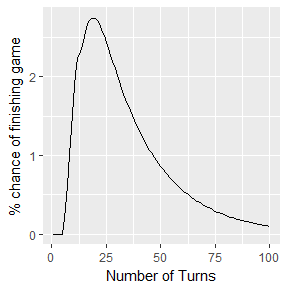
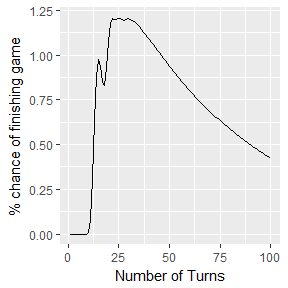
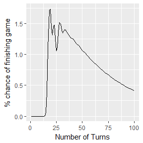
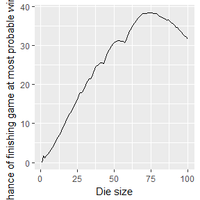

On Snakes and Ladders and Markov Chains
=======================================

Snakes and Ladders is a popular children's board game in which players try to be the first to reach the end of the board. The board consists of 100 squares, and players take turns rolling a single six sided die and moving along the board. If a player lands a snake or ladder, then the player will be move up or down to the square the ladder or snake ends at. The first player to reach square 100 wins

According to the official game rules, a player must land exactly on square 100, without overshooting. However, I think this rule is silly, and should never be used by anyone who enjoys fun. Thus, this rule is ignored by this package.

Markov chains are a way of simulating stochastic processes in which any particular state is independent of all other states. For example, existing on square 43 in Snakes and Ladders is independent of any previous board state or other players' positions. Therefore, simulations in this package will be games played by only one, lonely player. Markov chains utilize a transition matrix containing the all the probabilities of changing from one state to another. In this simulation, the states are positions on the game board, and the probabilities in the transition matrix correspond to the probability of landing on square b from square a.

In order to simulate a game, this transition matrix is multiplied by a vector listing the probability that a player is at a given square. At turn 0, this will be a vector with a 1 in the first entry, corresponding to the starting position of the player, and 0s in each subequent entry. The vector is multiplied by the transition matrix, and the resulting vector lists the probabilities that a player will be at each game square after turn one. This process is iterated for however many turns is specified (the default is 100).

This package creates transition matrices and runs markov chains simulations based on user defined inputs. Thus, a user can create a custom layout for a game of Snakes and Ladders, and analyze it with this package.

Using this package
==================

This package provides functions which utilize markov chains to compute probability information about snakes and ladders game states based on a defined set of parameters.

To run a simulation, call the function snakes\_and\_ladders\_sim. This function will prompt the user to input information about the size of the board, the size of the die, and the locations of snakes and ladders. The user may use the default game settings, or experiment with different kinds of parameters.

snakes\_and\_ladders\_sim will return a plot, the output of function finish\_game\_chance. This plot graphs the number of turns on the x-axis and the percentage chance of finishing the game in x moves on the y-axis. This plot fulfills the initial goal of the project, as it shows the number of turns it will typically take for a game of Snakes and Ladders to finish. The commented lines show the prompts given to the user, as well as the printed output that goes along with the returned plot.

``` r
#game_plot <- snakes_and_ladders_sim()
#how big of a board do you want (must be a number)? Select 0 for default size (100): 0
#How big of a die do you want (must be a number)? Typically 6 (obviously): 6
#How many turns do you want to simulate (again, must be a number)?  If not sure, use 100 : 100
#How many ladders and snakes are there?  Select 0 to use the default pattern for the Snakes and Ladders Board Game: 0
#[1] 19
print(game_plot)
```



As seen in the plot above, the turn number that a player will most likely finish at is 19, with a chance of approximately 2.7%. The function will also print the number of the turns with the highest % chance of finishing (in this case, 19).

Examples
========

Now, let's experiment. What happens if we decrease the size of the die?

``` r
#three_die_game_plot <- snakes_and_ladders_sim()
#how big of a board do you want (must be a number)? Select 0 for default size (100): 0
#How big of a die do you want (must be a number)? Typically 6 (obviously): 3
#How many turns do you want to simulate (again, must be a number)?  If not sure, use 100 : 100
#How many ladders and snakes are there?  Select 0 to use the default pattern for the Snakes and Ladders Board Game: 0
#[1] 25
print(three_die_game_plot)
```



Now, let's compare this graph to what we get if the die size is 2.

``` r
#two_die_game_plot <- snakes_and_ladders_sim()
#how big of a board do you want (must be a number)? Select 0 for default size (100): 0
#How big of a die do you want (must be a number)? Typically 6 (obviously): 2
#How many turns do you want to simulate (again, must be a number)?  If not sure, use 100 : 100
#How many ladders and snakes are there?  Select 0 to use the default pattern for the Snakes and Ladders Board Game: 0
#[1] 19
print(two_die_game_plot)
```



Interestingly, the game actually has a greater chance of finishing more quickly if the size of the die is two instead of three.

Other uses
==========

The functions provided by this package can be used by themselves, but have the potential to be modified for a wide variety of experimentation and analyses. I included the function roll\_probabilities as an example of the kind of experimentation that can be done with this base package.

roll\_probabilities runs through the entire game simulation, utilizing every possible die size from 1 to a set maximum (defaut:100. Note: Running this at very high numbers is bad news)

The output of roll probabilities is a graph of the die size on the x-axis and probability of completing a game after the number of turns that has the player has the greatest probability of finishing on at that die size. For example, for die size six, the number of turns the player has the greatest probability of finishing by is 19. The probability of finihsing the game in 19 turns is around 2.7. Therefore, the point on the graph returned by roll\_probabilities corresponding to this iteration will be (6, 2.7). This repeats for all die sizes up to the specified maximum.

``` r
roll_probabilities_plot <- roll_probabilities(maxroll = 100)
print(roll_probabilities_plot)
```



Now isn't that a nifty looking graph? I don't really know what this means though.

This is just one example of what can be accomplished by modifiying the base functions in this package. For more information please read the function documentation in detail.
